# 🔗 ブラックオニキス復刻版 - コンポーネント間相互作用図

## 📋 相互作用設計概要

### 設計目的
システム内の各コンポーネント間の相互作用を視覚化し、データフロー・制御フローを明確に定義する。

### 相互作用の種類
- **同期通信**: 直接メソッド呼び出し
- **非同期通信**: Promise/async-await
- **イベント通信**: カスタムイベント・リスナーパターン
- **データバインディング**: 状態変更の自動反映

## 🎮 メインゲームループ相互作用

### 1. ゲーム初期化フロー

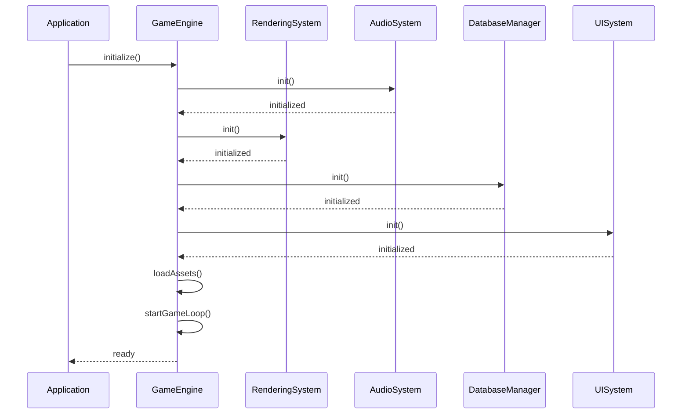
```mermaid
sequenceDiagram
    participant App as Application
    participant Engine as GameEngine
    participant Renderer as RenderingSystem
    participant Audio as AudioSystem
    participant DB as DatabaseManager
    participant UI as UISystem

    App->>Engine: initialize()
    Engine->>Audio: init()
    Audio-->>Engine: initialized
    Engine->>Renderer: init()
    Renderer-->>Engine: initialized
    Engine->>DB: init()
    DB-->>Engine: initialized
    Engine->>UI: init()
    UI-->>Engine: initialized
    Engine->>Engine: loadAssets()
    Engine->>Engine: startGameLoop()
    Engine-->>App: ready
```

### 2. ゲームループ実行フロー

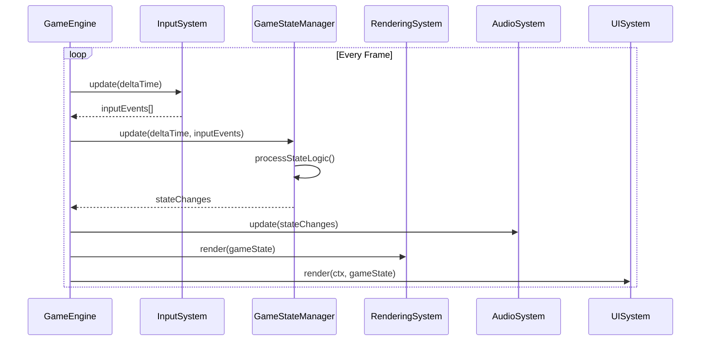
```mermaid
sequenceDiagram
    participant Engine as GameEngine
    participant Input as InputSystem
    participant Game as GameStateManager
    participant Renderer as RenderingSystem
    participant Audio as AudioSystem
    participant UI as UISystem

    loop Every Frame
        Engine->>Input: update(deltaTime)
        Input-->>Engine: inputEvents[]
        Engine->>Game: update(deltaTime, inputEvents)
        Game->>Game: processStateLogic()
        Game-->>Engine: stateChanges
        Engine->>Audio: update(stateChanges)
        Engine->>Renderer: render(gameState)
        Engine->>UI: render(ctx, gameState)
    end
```

## 🏰 ダンジョン探索相互作用

### 1. プレイヤー移動処理

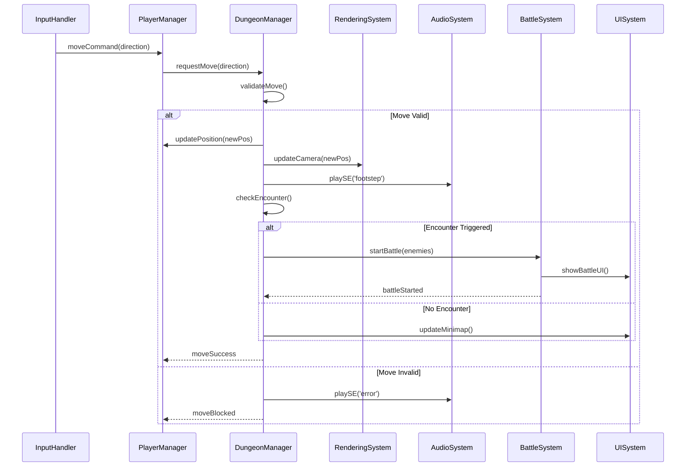
```mermaid
sequenceDiagram
    participant Input as InputHandler
    participant Player as PlayerManager
    participant Dungeon as DungeonManager
    participant Renderer as RenderingSystem
    participant Audio as AudioSystem
    participant Battle as BattleSystem
    participant UI as UISystem

    Input->>Player: moveCommand(direction)
    Player->>Dungeon: requestMove(direction)
    Dungeon->>Dungeon: validateMove()
    
    alt Move Valid
        Dungeon->>Player: updatePosition(newPos)
        Dungeon->>Renderer: updateCamera(newPos)
        Dungeon->>Audio: playSE('footstep')
        Dungeon->>Dungeon: checkEncounter()
        
        alt Encounter Triggered
            Dungeon->>Battle: startBattle(enemies)
            Battle->>UI: showBattleUI()
            Battle-->>Dungeon: battleStarted
        else No Encounter
            Dungeon->>UI: updateMinimap()
        end
        
        Dungeon-->>Player: moveSuccess
    else Move Invalid
        Dungeon->>Audio: playSE('error')
        Dungeon-->>Player: moveBlocked
    end
```

### 2. オブジェクト相互作用

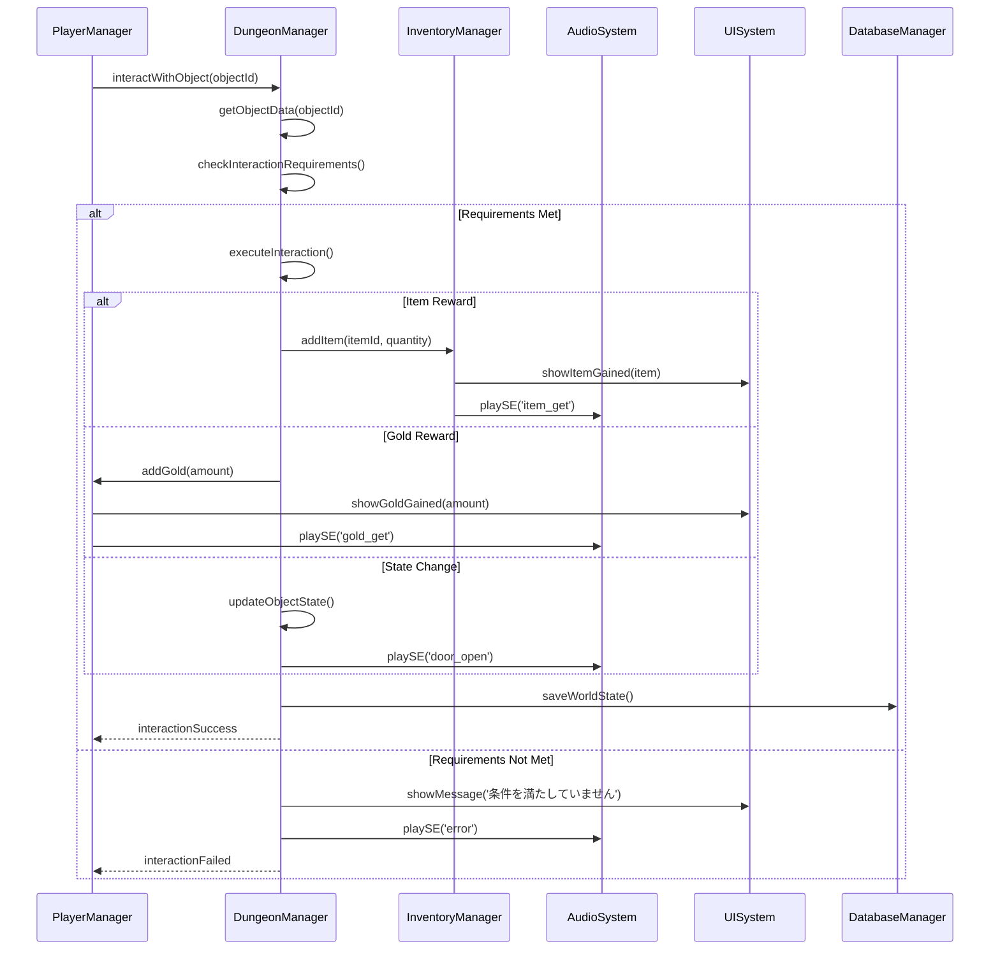
```mermaid
sequenceDiagram
    participant Player as PlayerManager
    participant Dungeon as DungeonManager
    participant Inventory as InventoryManager
    participant Audio as AudioSystem
    participant UI as UISystem
    participant DB as DatabaseManager

    Player->>Dungeon: interactWithObject(objectId)
    Dungeon->>Dungeon: getObjectData(objectId)
    Dungeon->>Dungeon: checkInteractionRequirements()
    
    alt Requirements Met
        Dungeon->>Dungeon: executeInteraction()
        
        alt Item Reward
            Dungeon->>Inventory: addItem(itemId, quantity)
            Inventory->>UI: showItemGained(item)
            Inventory->>Audio: playSE('item_get')
        else Gold Reward
            Dungeon->>Player: addGold(amount)
            Player->>UI: showGoldGained(amount)
            Player->>Audio: playSE('gold_get')
        else State Change
            Dungeon->>Dungeon: updateObjectState()
            Dungeon->>Audio: playSE('door_open')
        end
        
        Dungeon->>DB: saveWorldState()
        Dungeon-->>Player: interactionSuccess
    else Requirements Not Met
        Dungeon->>UI: showMessage('条件を満たしていません')
        Dungeon->>Audio: playSE('error')
        Dungeon-->>Player: interactionFailed
    end
```

## ⚔️ 戦闘システム相互作用

### 1. 戦闘開始・初期化

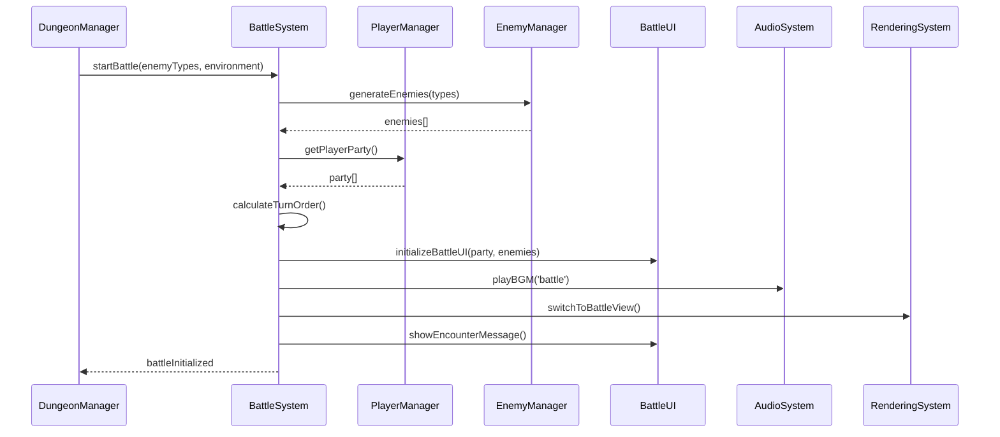
```mermaid
sequenceDiagram
    participant Dungeon as DungeonManager
    participant Battle as BattleSystem
    participant Player as PlayerManager
    participant Enemy as EnemyManager
    participant UI as BattleUI
    participant Audio as AudioSystem
    participant Renderer as RenderingSystem

    Dungeon->>Battle: startBattle(enemyTypes, environment)
    Battle->>Enemy: generateEnemies(types)
    Enemy-->>Battle: enemies[]
    Battle->>Player: getPlayerParty()
    Player-->>Battle: party[]
    Battle->>Battle: calculateTurnOrder()
    Battle->>UI: initializeBattleUI(party, enemies)
    Battle->>Audio: playBGM('battle')
    Battle->>Renderer: switchToBattleView()
    Battle->>UI: showEncounterMessage()
    Battle-->>Dungeon: battleInitialized
```

### 2. 戦闘ターン処理

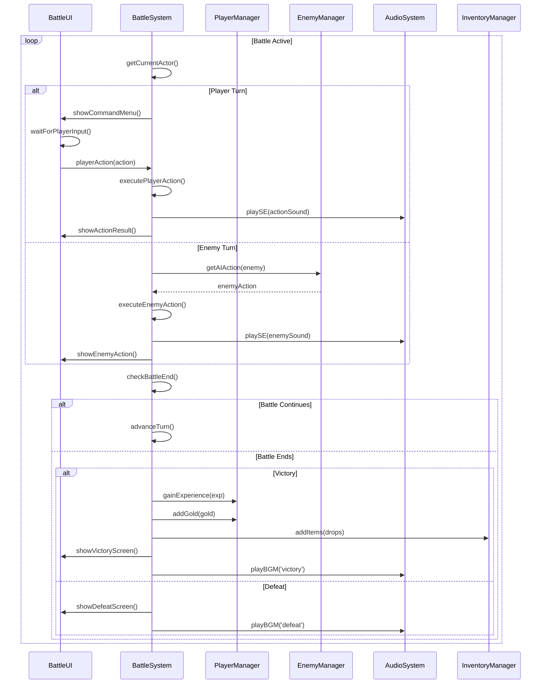
```mermaid
sequenceDiagram
    participant UI as BattleUI
    participant Battle as BattleSystem
    participant Player as PlayerManager
    participant Enemy as EnemyManager
    participant Audio as AudioSystem
    participant Inventory as InventoryManager

    loop Battle Active
        Battle->>Battle: getCurrentActor()
        
        alt Player Turn
            Battle->>UI: showCommandMenu()
            UI->>UI: waitForPlayerInput()
            UI->>Battle: playerAction(action)
            Battle->>Battle: executePlayerAction()
            Battle->>Audio: playSE(actionSound)
            Battle->>UI: showActionResult()
        else Enemy Turn
            Battle->>Enemy: getAIAction(enemy)
            Enemy-->>Battle: enemyAction
            Battle->>Battle: executeEnemyAction()
            Battle->>Audio: playSE(enemySound)
            Battle->>UI: showEnemyAction()
        end
        
        Battle->>Battle: checkBattleEnd()
        
        alt Battle Continues
            Battle->>Battle: advanceTurn()
        else Battle Ends
            alt Victory
                Battle->>Player: gainExperience(exp)
                Battle->>Player: addGold(gold)
                Battle->>Inventory: addItems(drops)
                Battle->>UI: showVictoryScreen()
                Battle->>Audio: playBGM('victory')
            else Defeat
                Battle->>UI: showDefeatScreen()
                Battle->>Audio: playBGM('defeat')
            end
        end
    end
```

### 3. アイテム使用フロー

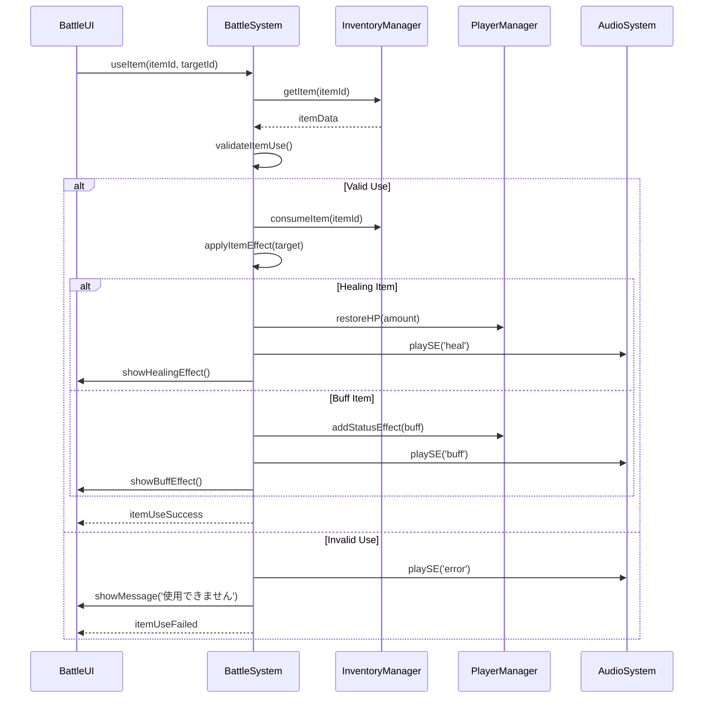
```mermaid
sequenceDiagram
    participant UI as BattleUI
    participant Battle as BattleSystem
    participant Inventory as InventoryManager
    participant Player as PlayerManager
    participant Audio as AudioSystem

    UI->>Battle: useItem(itemId, targetId)
    Battle->>Inventory: getItem(itemId)
    Inventory-->>Battle: itemData
    Battle->>Battle: validateItemUse()
    
    alt Valid Use
        Battle->>Inventory: consumeItem(itemId)
        Battle->>Battle: applyItemEffect(target)
        
        alt Healing Item
            Battle->>Player: restoreHP(amount)
            Battle->>Audio: playSE('heal')
            Battle->>UI: showHealingEffect()
        else Buff Item
            Battle->>Player: addStatusEffect(buff)
            Battle->>Audio: playSE('buff')
            Battle->>UI: showBuffEffect()
        end
        
        Battle-->>UI: itemUseSuccess
    else Invalid Use
        Battle->>Audio: playSE('error')
        Battle->>UI: showMessage('使用できません')
        Battle-->>UI: itemUseFailed
    end
```

## 📦 インベントリ管理相互作用

### 1. アイテム取得・管理

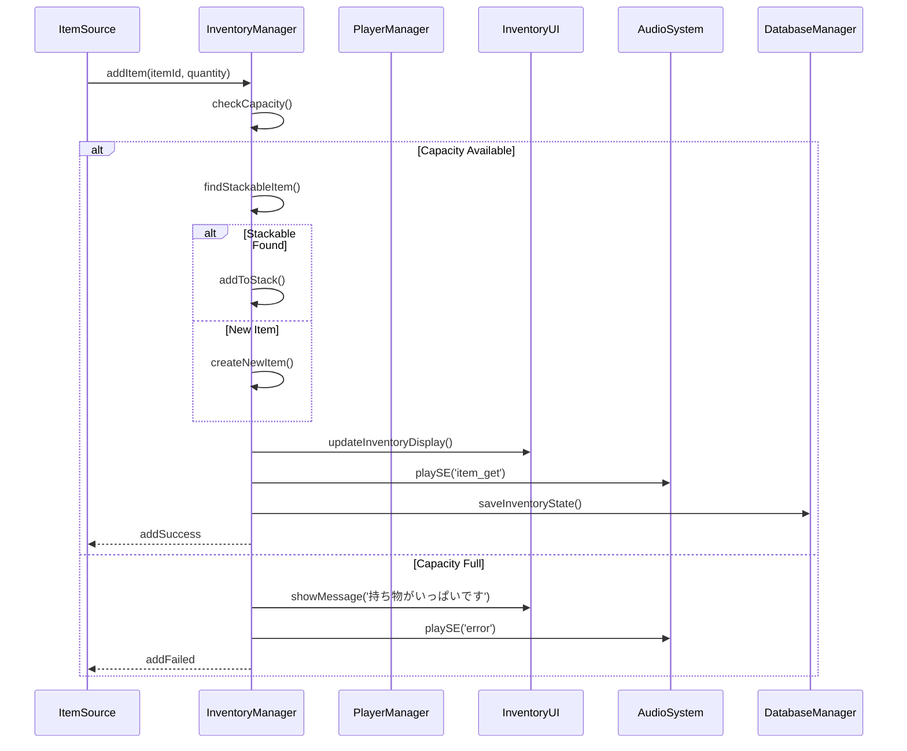
```mermaid
sequenceDiagram
    participant Source as ItemSource
    participant Inventory as InventoryManager
    participant Player as PlayerManager
    participant UI as InventoryUI
    participant Audio as AudioSystem
    participant DB as DatabaseManager

    Source->>Inventory: addItem(itemId, quantity)
    Inventory->>Inventory: checkCapacity()
    
    alt Capacity Available
        Inventory->>Inventory: findStackableItem()
        
        alt Stackable Found
            Inventory->>Inventory: addToStack()
        else New Item
            Inventory->>Inventory: createNewItem()
        end
        
        Inventory->>UI: updateInventoryDisplay()
        Inventory->>Audio: playSE('item_get')
        Inventory->>DB: saveInventoryState()
        Inventory-->>Source: addSuccess
    else Capacity Full
        Inventory->>UI: showMessage('持ち物がいっぱいです')
        Inventory->>Audio: playSE('error')
        Inventory-->>Source: addFailed
    end
```

### 2. 装備変更処理

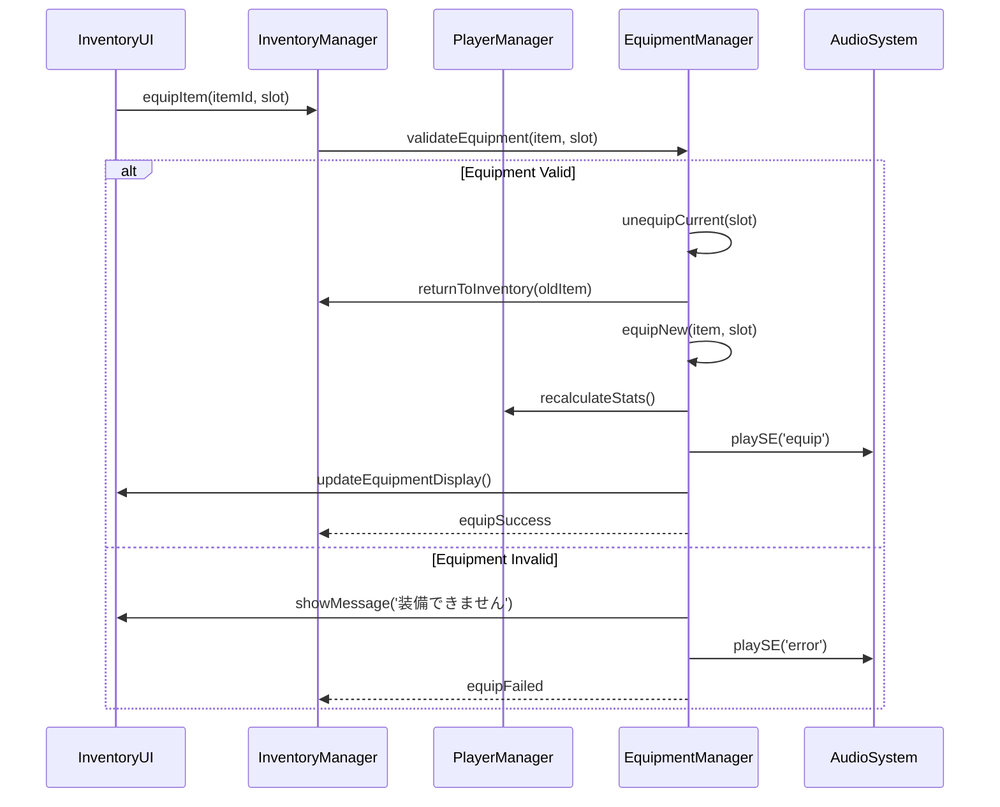
```mermaid
sequenceDiagram
    participant UI as InventoryUI
    participant Inventory as InventoryManager
    participant Player as PlayerManager
    participant Equipment as EquipmentManager
    participant Audio as AudioSystem

    UI->>Inventory: equipItem(itemId, slot)
    Inventory->>Equipment: validateEquipment(item, slot)
    
    alt Equipment Valid
        Equipment->>Equipment: unequipCurrent(slot)
        Equipment->>Inventory: returnToInventory(oldItem)
        Equipment->>Equipment: equipNew(item, slot)
        Equipment->>Player: recalculateStats()
        Equipment->>Audio: playSE('equip')
        Equipment->>UI: updateEquipmentDisplay()
        Equipment-->>Inventory: equipSuccess
    else Equipment Invalid
        Equipment->>UI: showMessage('装備できません')
        Equipment->>Audio: playSE('error')
        Equipment-->>Inventory: equipFailed
    end
```

## 💾 データ永続化相互作用

### 1. セーブ処理フロー

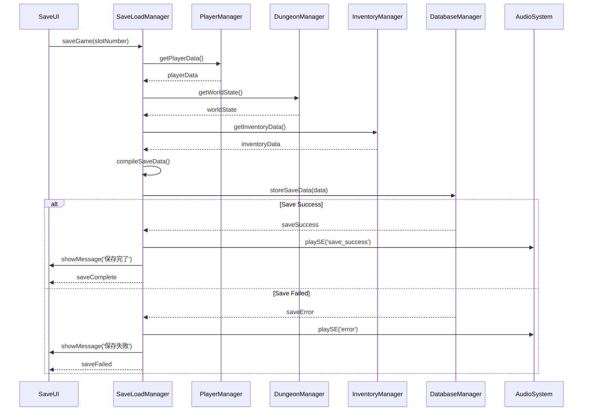
```mermaid
sequenceDiagram
    participant UI as SaveUI
    participant Save as SaveLoadManager
    participant Player as PlayerManager
    participant Dungeon as DungeonManager
    participant Inventory as InventoryManager
    participant DB as DatabaseManager
    participant Audio as AudioSystem

    UI->>Save: saveGame(slotNumber)
    Save->>Player: getPlayerData()
    Player-->>Save: playerData
    Save->>Dungeon: getWorldState()
    Dungeon-->>Save: worldState
    Save->>Inventory: getInventoryData()
    Inventory-->>Save: inventoryData
    Save->>Save: compileSaveData()
    Save->>DB: storeSaveData(data)
    
    alt Save Success
        DB-->>Save: saveSuccess
        Save->>Audio: playSE('save_success')
        Save->>UI: showMessage('保存完了')
        Save-->>UI: saveComplete
    else Save Failed
        DB-->>Save: saveError
        Save->>Audio: playSE('error')
        Save->>UI: showMessage('保存失敗')
        Save-->>UI: saveFailed
    end
```

### 2. ロード処理フロー

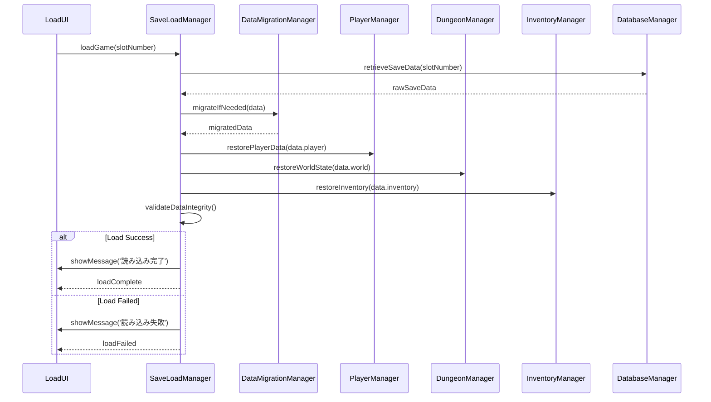
```mermaid
sequenceDiagram
    participant UI as LoadUI
    participant Save as SaveLoadManager
    participant Migration as DataMigrationManager
    participant Player as PlayerManager
    participant Dungeon as DungeonManager
    participant Inventory as InventoryManager
    participant DB as DatabaseManager

    UI->>Save: loadGame(slotNumber)
    Save->>DB: retrieveSaveData(slotNumber)
    DB-->>Save: rawSaveData
    Save->>Migration: migrateIfNeeded(data)
    Migration-->>Save: migratedData
    Save->>Player: restorePlayerData(data.player)
    Save->>Dungeon: restoreWorldState(data.world)
    Save->>Inventory: restoreInventory(data.inventory)
    Save->>Save: validateDataIntegrity()
    
    alt Load Success
        Save->>UI: showMessage('読み込み完了')
        Save-->>UI: loadComplete
    else Load Failed
        Save->>UI: showMessage('読み込み失敗')
        Save-->>UI: loadFailed
    end
```

## 🎵 オーディオシステム相互作用

### 1. BGM管理フロー

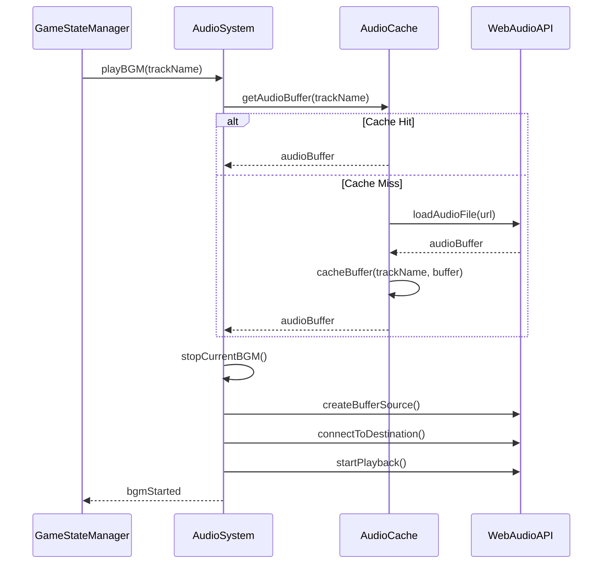
```mermaid
sequenceDiagram
    participant Game as GameStateManager
    participant Audio as AudioSystem
    participant Cache as AudioCache
    participant WebAudio as WebAudioAPI

    Game->>Audio: playBGM(trackName)
    Audio->>Cache: getAudioBuffer(trackName)
    
    alt Cache Hit
        Cache-->>Audio: audioBuffer
    else Cache Miss
        Cache->>WebAudio: loadAudioFile(url)
        WebAudio-->>Cache: audioBuffer
        Cache->>Cache: cacheBuffer(trackName, buffer)
        Cache-->>Audio: audioBuffer
    end
    
    Audio->>Audio: stopCurrentBGM()
    Audio->>WebAudio: createBufferSource()
    Audio->>WebAudio: connectToDestination()
    Audio->>WebAudio: startPlayback()
    Audio-->>Game: bgmStarted
```

### 2. SE再生フロー

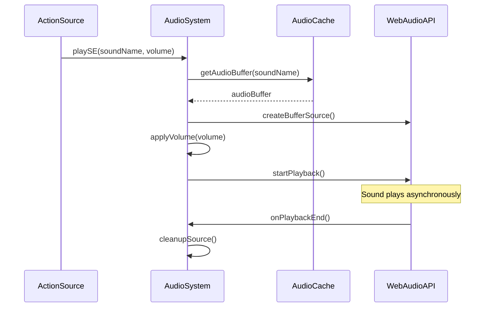
```mermaid
sequenceDiagram
    participant Action as ActionSource
    participant Audio as AudioSystem
    participant Cache as AudioCache
    participant WebAudio as WebAudioAPI

    Action->>Audio: playSE(soundName, volume)
    Audio->>Cache: getAudioBuffer(soundName)
    Cache-->>Audio: audioBuffer
    Audio->>WebAudio: createBufferSource()
    Audio->>Audio: applyVolume(volume)
    Audio->>WebAudio: startPlayback()
    
    Note over WebAudio: Sound plays asynchronously
    
    WebAudio->>Audio: onPlaybackEnd()
    Audio->>Audio: cleanupSource()
```

## 🖥️ UI システム相互作用

### 1. ユーザー入力処理

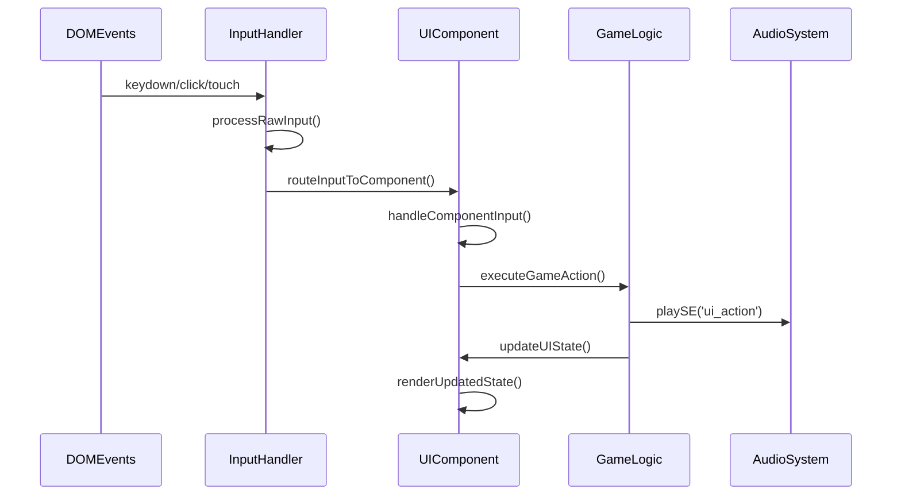
```mermaid
sequenceDiagram
    participant DOM as DOMEvents
    participant Input as InputHandler
    participant UI as UIComponent
    participant Game as GameLogic
    participant Audio as AudioSystem

    DOM->>Input: keydown/click/touch
    Input->>Input: processRawInput()
    Input->>UI: routeInputToComponent()
    UI->>UI: handleComponentInput()
    UI->>Game: executeGameAction()
    Game->>Audio: playSE('ui_action')
    Game->>UI: updateUIState()
    UI->>UI: renderUpdatedState()
```

### 2. 状態反映フロー

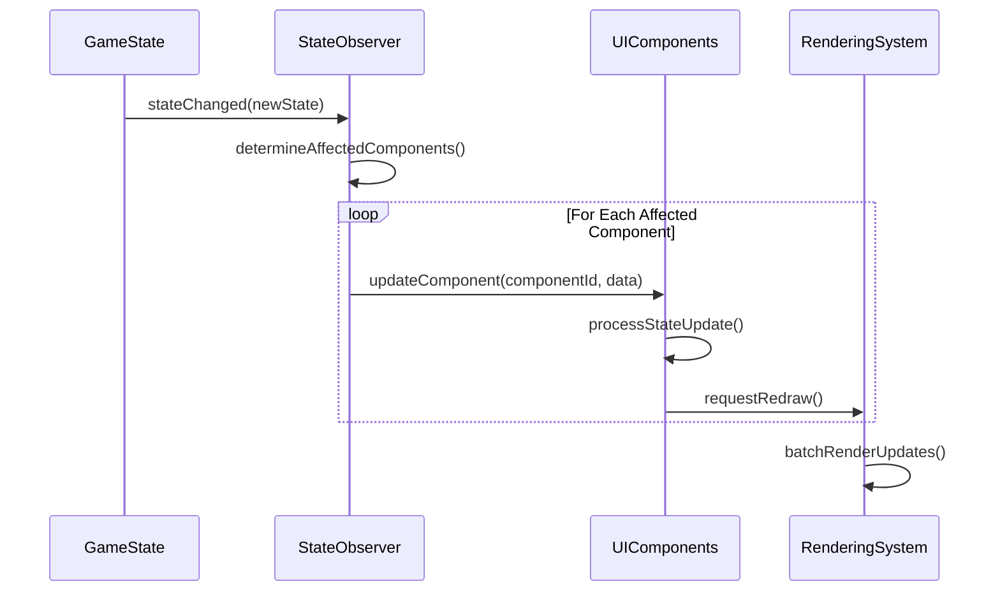
```mermaid
sequenceDiagram
    participant Game as GameState
    participant Observer as StateObserver
    participant UI as UIComponents
    participant Renderer as RenderingSystem

    Game->>Observer: stateChanged(newState)
    Observer->>Observer: determineAffectedComponents()
    
    loop For Each Affected Component
        Observer->>UI: updateComponent(componentId, data)
        UI->>UI: processStateUpdate()
        UI->>Renderer: requestRedraw()
    end
    
    Renderer->>Renderer: batchRenderUpdates()
```

## 🔄 エラーハンドリング相互作用

### 1. エラー伝播フロー

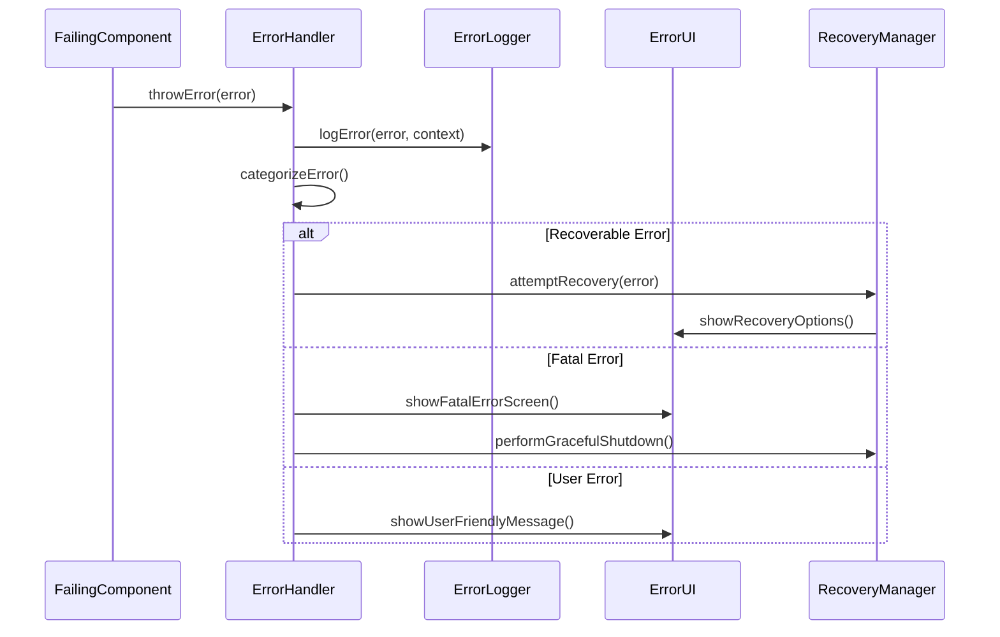
```mermaid
sequenceDiagram
    participant Component as FailingComponent
    participant Error as ErrorHandler
    participant Logger as ErrorLogger
    participant UI as ErrorUI
    participant Recovery as RecoveryManager

    Component->>Error: throwError(error)
    Error->>Logger: logError(error, context)
    Error->>Error: categorizeError()
    
    alt Recoverable Error
        Error->>Recovery: attemptRecovery(error)
        Recovery->>UI: showRecoveryOptions()
    else Fatal Error
        Error->>UI: showFatalErrorScreen()
        Error->>Recovery: performGracefulShutdown()
    else User Error
        Error->>UI: showUserFriendlyMessage()
    end
```

## 📈 パフォーマンス最適化相互作用

### 1. リソース管理フロー

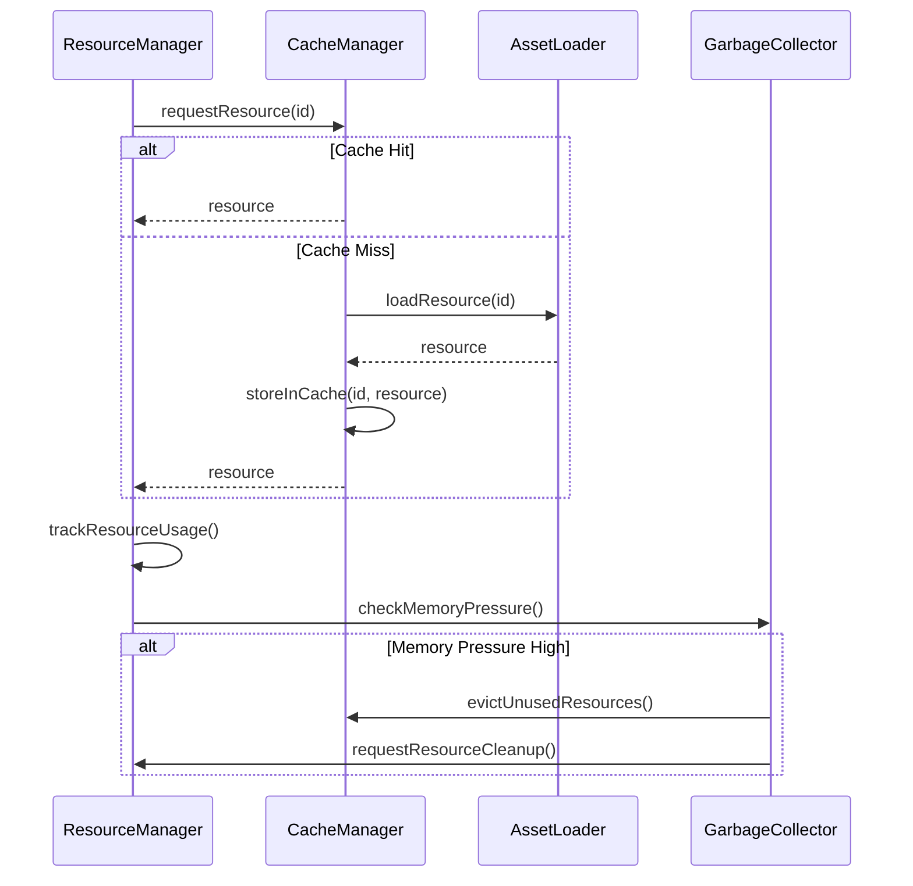
```mermaid
sequenceDiagram
    participant Manager as ResourceManager
    participant Cache as CacheManager
    participant Loader as AssetLoader
    participant GC as GarbageCollector

    Manager->>Cache: requestResource(id)
    
    alt Cache Hit
        Cache-->>Manager: resource
    else Cache Miss
        Cache->>Loader: loadResource(id)
        Loader-->>Cache: resource
        Cache->>Cache: storeInCache(id, resource)
        Cache-->>Manager: resource
    end
    
    Manager->>Manager: trackResourceUsage()
    Manager->>GC: checkMemoryPressure()
    
    alt Memory Pressure High
        GC->>Cache: evictUnusedResources()
        GC->>Manager: requestResourceCleanup()
    end
```

### 2. 描画最適化フロー

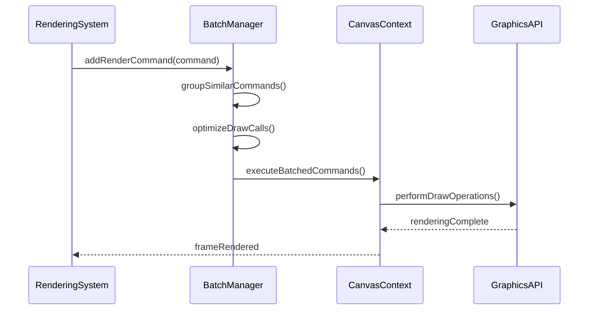
```mermaid
sequenceDiagram
    participant Renderer as RenderingSystem
    participant Batch as BatchManager
    participant Canvas as CanvasContext
    participant GPU as GraphicsAPI

    Renderer->>Batch: addRenderCommand(command)
    Batch->>Batch: groupSimilarCommands()
    Batch->>Batch: optimizeDrawCalls()
    Batch->>Canvas: executeBatchedCommands()
    Canvas->>GPU: performDrawOperations()
    GPU-->>Canvas: renderingComplete
    Canvas-->>Renderer: frameRendered
```

---

**コンポーネント間相互作用図バージョン**: 1.0  
**最終更新**: 2025年7月26日  
**承認者**: Black Onyx Reborn Development Team  
**実装指針**: 相互作用図に従い、適切な依存関係とデータフローを実装すること