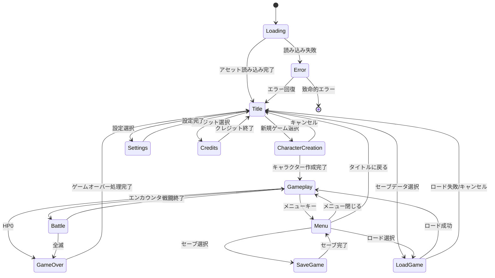
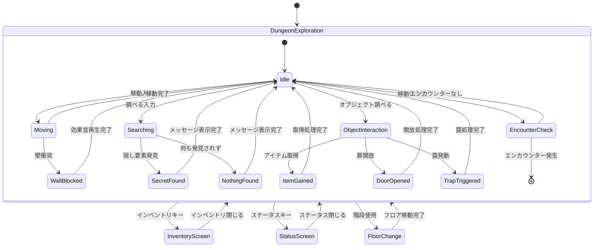
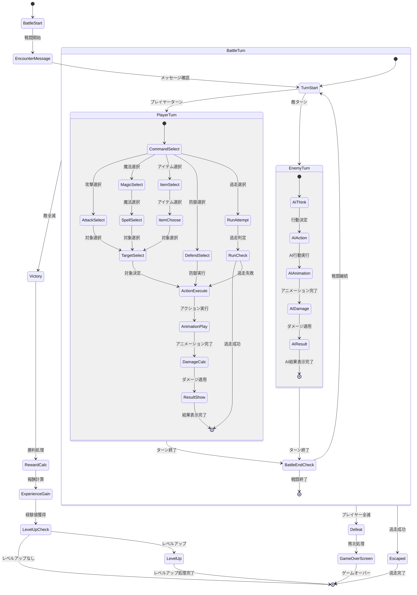
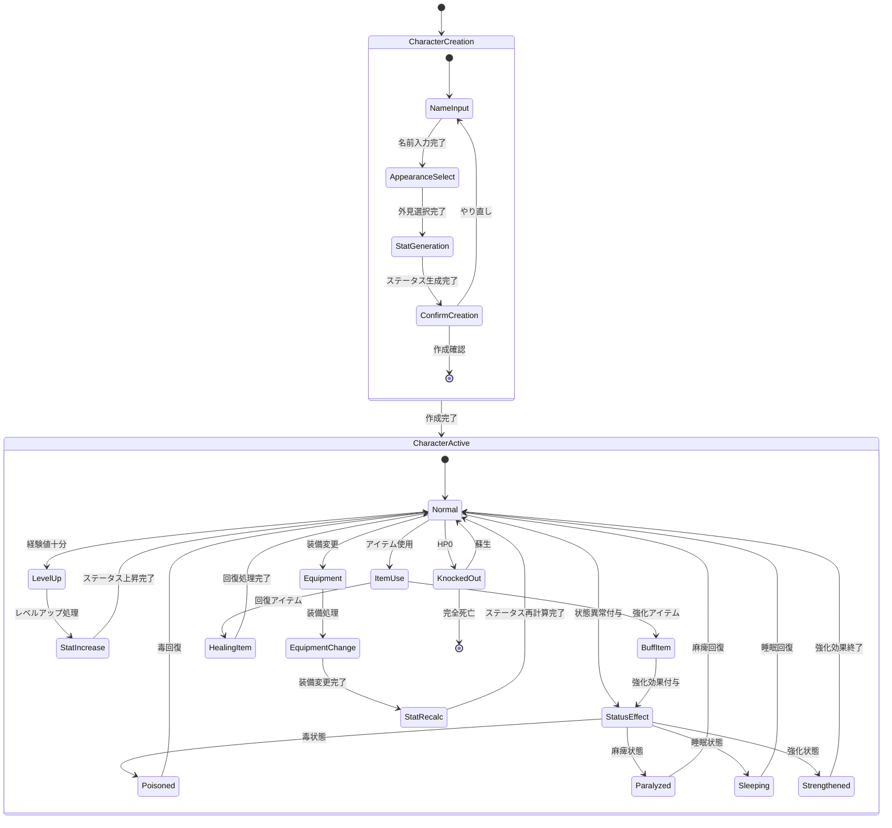
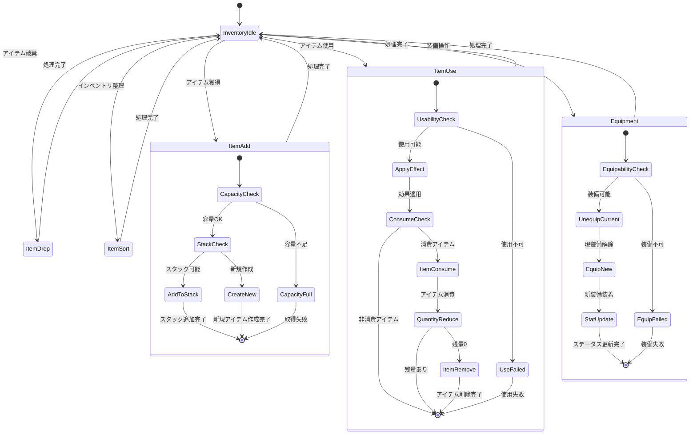
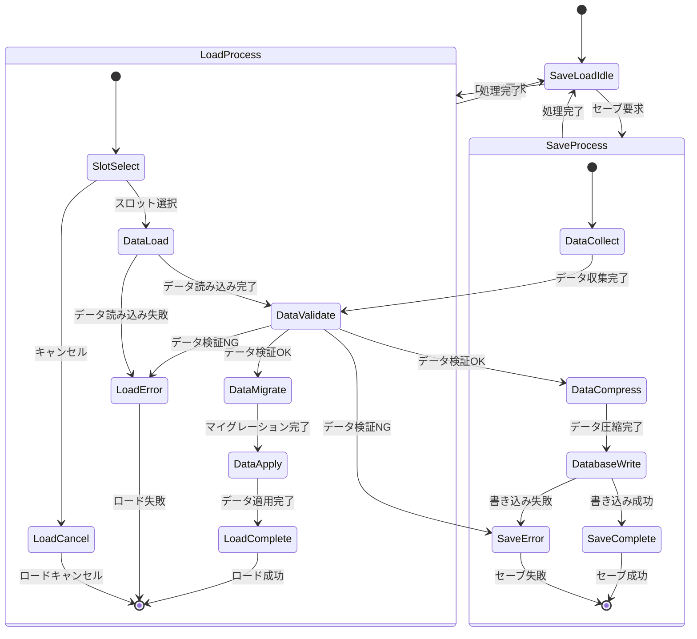
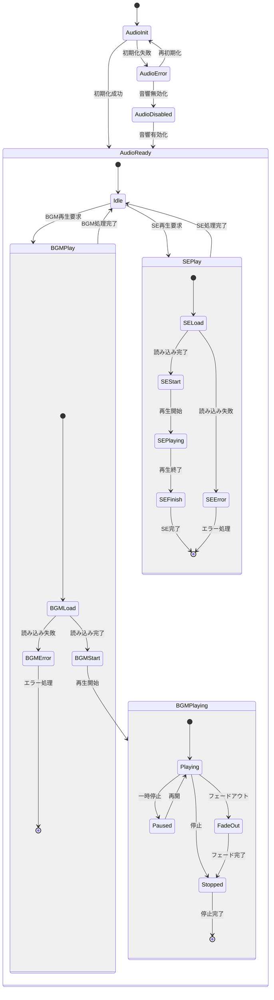

# 🔄 ブラックオニキス復刻版 - ゲーム状態遷移図

## 📋 状態遷移設計概要

### 設計目的
ゲーム全体の状態管理を明確に定義し、状態間の遷移条件・処理を可視化する。

### 状態管理原則
- **明確な状態定義**: 各状態の責任範囲を明確化
- **遷移条件の明示**: 状態変更のトリガーを具体化
- **データ整合性**: 状態変更時のデータ保護
- **エラー復帰**: 異常状態からの復旧手順

## 🎮 メインゲーム状態遷移

### 1. アプリケーション全体状態



### 2. ゲームプレイ詳細状態



### 3. 戦闘状態遷移



### 4. キャラクター管理状態



### 5. インベントリ管理状態



### 6. セーブ・ロード状態



### 7. オーディオシステム状態



## 🔧 状態管理実装クラス

### 状態管理基底クラス

```typescript
/**
 * 状態管理基底クラス
 */
abstract class StateMachine<TState extends string> {
    protected currentState: TState;
    protected previousState: TState | null = null;
    protected stateHistory: TState[] = [];
    protected transitions: Map<TState, TState[]> = new Map();
    protected stateData: Map<TState, any> = new Map();
    protected listeners: Map<string, Function[]> = new Map();
    
    constructor(initialState: TState) {
        this.currentState = initialState;
        this.stateHistory.push(initialState);
    }
    
    /**
     * 状態遷移定義
     */
    protected defineTransition(from: TState, to: TState[]): void {
        this.transitions.set(from, to);
    }
    
    /**
     * 状態変更
     */
    async transitionTo(newState: TState, data?: any): Promise<boolean> {
        // 遷移可能性チェック
        if (!this.canTransitionTo(newState)) {
            console.warn(`Invalid transition: ${this.currentState} -> ${newState}`);
            return false;
        }
        
        const oldState = this.currentState;
        
        try {
            // 現在状態の終了処理
            await this.onStateExit(oldState);
            
            // 状態更新
            this.previousState = oldState;
            this.currentState = newState;
            this.stateHistory.push(newState);
            
            // 状態データ設定
            if (data) {
                this.stateData.set(newState, data);
            }
            
            // 新状態の開始処理
            await this.onStateEnter(newState, data);
            
            // リスナー通知
            this.notifyStateChange(oldState, newState);
            
            return true;
        } catch (error) {
            // エラー時はロールバック
            this.currentState = oldState;
            throw error;
        }
    }
    
    /**
     * 遷移可能性判定
     */
    protected canTransitionTo(newState: TState): boolean {
        const allowedTransitions = this.transitions.get(this.currentState);
        return allowedTransitions ? allowedTransitions.includes(newState) : false;
    }
    
    /**
     * 状態開始処理（サブクラスで実装）
     */
    protected abstract onStateEnter(state: TState, data?: any): Promise<void>;
    
    /**
     * 状態終了処理（サブクラスで実装）
     */
    protected abstract onStateExit(state: TState): Promise<void>;
    
    /**
     * 現在状態取得
     */
    getCurrentState(): TState {
        return this.currentState;
    }
    
    /**
     * 状態履歴取得
     */
    getStateHistory(): TState[] {
        return [...this.stateHistory];
    }
    
    /**
     * 状態変更リスナー登録
     */
    onStateChange(callback: (oldState: TState, newState: TState) => void): void {
        if (!this.listeners.has('stateChange')) {
            this.listeners.set('stateChange', []);
        }
        this.listeners.get('stateChange')!.push(callback);
    }
    
    private notifyStateChange(oldState: TState, newState: TState): void {
        const callbacks = this.listeners.get('stateChange') || [];
        callbacks.forEach(callback => callback(oldState, newState));
    }
}

/**
 * ゲームメイン状態管理
 */
type GameState = 'loading' | 'title' | 'character_creation' | 'gameplay' | 'battle' | 'menu' | 'game_over';

class GameStateMachine extends StateMachine<GameState> {
    constructor() {
        super('loading');
        this.setupTransitions();
    }
    
    private setupTransitions(): void {
        this.defineTransition('loading', ['title', 'error']);
        this.defineTransition('title', ['character_creation', 'gameplay', 'settings']);
        this.defineTransition('character_creation', ['gameplay', 'title']);
        this.defineTransition('gameplay', ['battle', 'menu']);
        this.defineTransition('battle', ['gameplay', 'game_over']);
        this.defineTransition('menu', ['gameplay', 'title']);
        this.defineTransition('game_over', ['title']);
    }
    
    protected async onStateEnter(state: GameState, data?: any): Promise<void> {
        switch (state) {
            case 'loading':
                await this.handleLoadingEnter();
                break;
            case 'title':
                await this.handleTitleEnter();
                break;
            case 'character_creation':
                await this.handleCharacterCreationEnter();
                break;
            case 'gameplay':
                await this.handleGameplayEnter(data);
                break;
            case 'battle':
                await this.handleBattleEnter(data);
                break;
            case 'menu':
                await this.handleMenuEnter();
                break;
            case 'game_over':
                await this.handleGameOverEnter();
                break;
        }
    }
    
    protected async onStateExit(state: GameState): Promise<void> {
        switch (state) {
            case 'loading':
                await this.handleLoadingExit();
                break;
            case 'gameplay':
                await this.handleGameplayExit();
                break;
            case 'battle':
                await this.handleBattleExit();
                break;
            // その他の状態の終了処理
        }
    }
    
    private async handleLoadingEnter(): Promise<void> {
        // アセット読み込み開始
        console.log('Loading assets...');
    }
    
    private async handleBattleEnter(battleData: any): Promise<void> {
        // 戦闘UI初期化
        // BGM変更
        console.log('Battle started:', battleData);
    }
    
    // その他のハンドラー実装...
}
```

---

**ゲーム状態遷移図バージョン**: 1.0  
**最終更新**: 2025年7月26日  
**承認者**: Black Onyx Reborn Development Team  
**実装方針**: 状態遷移図に基づき、明確な状態管理とエラーハンドリングを実装すること